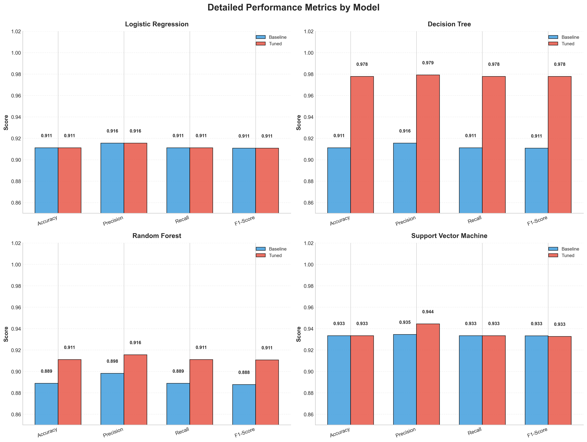

# Iris Classification Machine Learning Pipeline

[](https://python.org)
[](https://scikit-learn.org)
[](LICENSE)

A comprehensive machine learning project demonstrating end-to-end classification using multiple algorithms with hyperparameter optimization and professional data visualizations.

## Project Overview

This project showcases a complete machine learning pipeline for the classic Iris classification problem, featuring:

- **Exploratory Data Analysis** with comprehensive visualizations
- **Data Preprocessing** with feature scaling and train-test splitting
- **Model Training** with 4 different classification algorithms
- **Hyperparameter Optimization** using GridSearchCV
- **Performance Comparison** with detailed metrics and analysis
- **Professional Visualizations** with publication-ready design

## Dataset

- **Dataset**: Iris Flower Classification
- **Features**: 4 numerical measurements (sepal length, sepal width, petal length, petal width)
- **Classes**: 3 iris species (Setosa, Versicolor, Virginica)
- **Samples**: 150 observations
- **Balance**: Perfectly balanced (50 samples per class)

## Tech Stack

- **Language**: Python 3.10+
- **ML Framework**: Scikit-learn
- **Data Analysis**: Pandas, NumPy
- **Visualization**: Matplotlib, Seaborn
- **Package Management**: UV
- **Development**: Jupyter Notebooks for exploration, Python scripts for production

## Models Trained

### Baseline Models
1. **Logistic Regression** - Linear classifier with L2 regularization
2. **Decision Tree** - Non-linear classifier with Gini impurity
3. **Random Forest** - Ensemble method with 100 trees
4. **Support Vector Machine** - RBF kernel with C=1.0

### Hyperparameter Tuning
- **GridSearchCV** with 5-fold cross-validation
- **Parameter Grids**: 20+ combinations per model
- **Scoring Metric**: Accuracy
- **Validation**: Stratified sampling to maintain class balance

## Results & Performance

### Final Model Rankings

| Rank | Model | Test Accuracy | CV Score | Improvement |
|------|-------|---------------|----------|-------------|
| 🥇 | **Decision Tree (Tuned)** | **97.78%** | 95.24% | +7.32% |
| 🥈 | **Support Vector Machine** | **93.33%** | 98.10% | +0.00% |
| 🥉 | **Logistic Regression** | **91.11%** | 98.10% | +0.00% |
| 4️⃣ | **Random Forest (Tuned)** | **91.11%** | 96.19% | +2.50% |



### Key Findings

- **Best Performer**: Decision Tree with max_depth=3 achieved 97.78% accuracy
- **Perfect Separation**: All models perfectly classified Iris-setosa (100% precision)
- **Stable Performance**: Low variance across cross-validation folds (std < 0.04)
- **Hyperparameter Impact**: Decision Tree showed highest improvement from tuning (7.32%)
- **Linear Models**: SVM and Logistic Regression were already near-optimal

## 📊 Visualizations

### Exploratory Data Analysis (`results/EDA/`)
- **Feature Distributions**: Histograms showing data distribution patterns
- **Correlation Heatmap**: Feature correlation matrix with annotations
- **Pairwise Relationships**: Scatter plot matrix with class separation
- **Box Plots**: Statistical summary and outlier detection

### Model Performance Analysis (`results/ML/`)
- **Accuracy Comparison**: Bar chart comparing model performance
- **Confusion Matrices**: Individual confusion matrices for each model
- **Cross-Validation Scores**: CV performance across different models
- **Average Metrics**: Precision, recall, and F1-score comparison
- **Improvement Analysis**: Before/after hyperparameter tuning results

## Project Structure

```
iris_classification/
├── data/                     # Dataset files
│   ├── features.csv         # Input features (150x4)
│   └── targets.csv          # Target labels (150x1)
├── notebooks/               # Jupyter notebooks for exploration
│   ├── data_ingestion.ipynb # Data loading and preparation
│   ├── EDA.ipynb           # Exploratory data analysis
│   ├── ml_pipeline.ipynb   # Machine learning pipeline
│   └── ml_vis.ipynb        # Visualization creation
├── src/                     # Production-ready Python modules
│   ├── config.py           # Configuration management
│   ├── logger.py           # Structured logging
│   ├── data_loader.py      # Data loading and validation
│   ├── data_validation.py  # Data quality checks
│   ├── model_trainer.py    # Model training and evaluation
│   ├── api.py             # FastAPI service for inference
│   ├── ml_pipeline_refactored.py # Refactored main pipeline
│   ├── eda_analysis.py    # Exploratory data analysis
│   ├── ml_pipeline.py     # Original ML pipeline
│   └── ml_visualizations.py # Visualization generator
├── tests/                   # Comprehensive test suite
│   ├── conftest.py        # Pytest configuration
│   ├── test_config.py      # Configuration tests
│   └── test_validation.py  # Data validation tests
├── config/                  # Configuration files
│   └── config.yaml        # Main configuration
├── results/                 # Generated outputs
│   ├── EDA/                # EDA visualizations
│   ├── ML/                 # ML pipeline results
│   └── MODEL RESULTS/      # Serialized model results
├── logs/                    # Application logs
├── main.py                  # Original entry point
├── pyproject.toml          # Project configuration
├── uv.lock                 # Dependency lock file
├── Dockerfile              # Container configuration
├── docker-compose.yml      # Multi-service deployment
├── .dockerignore          # Docker ignore rules
└── README.md               # This file
```

## Quick Start

### Prerequisites
- Python 3.10+
- UV package manager
- Docker (optional, for containerized deployment)

### Installation

```bash
# Clone the repository
git clone <repository-url>
cd iris_classification

# Install dependencies
uv sync

# Run the complete pipeline (refactored version)
python src/ml_pipeline_refactored.py
```

### Usage

#### Production Pipeline (Recommended)
```bash
# Run the refactored modular pipeline
python src/ml_pipeline_refactored.py

# Run with custom configuration
python src/ml_pipeline_refactored.py --config config/custom_config.yaml
```

#### API Server
```bash
# Start the FastAPI server
python src/api.py

# Or with custom settings
python src/api.py --host 0.0.0.0 --port 8000 --reload
```

#### Docker Deployment
```bash
# Build and run with Docker Compose
docker-compose up -d

# Access services:
# - API: http://localhost:8000
# - API Docs: http://localhost:8000/docs
# - Jupyter: http://localhost:8888
# - MLflow: http://localhost:5000
```

#### Development Workflow
```bash
# Install development dependencies
uv sync --dev

# Run tests
pytest tests/

# Run with hot reload during development
uv run python src/ml_pipeline_refactored.py
```

#### Jupyter Notebooks
```bash
# Run Jupyter for exploration
jupyter notebook notebooks/

# Or with Docker
docker-compose up jupyter
```

## Modules & Scripts

### Core Modules (`src/`)

#### `config.py`
- Comprehensive configuration management with YAML support
- Environment-based configuration system
- Type-safe configuration classes
- Automatic directory creation

#### `logger.py`
- Structured logging with file and console output
- Configurable log levels and formats
- Function call decorators for debugging
- Performance and experiment logging utilities

#### `data_loader.py`
- Comprehensive data loading and validation
- CSV file handling with error checking
- Target encoding with LabelEncoder
- Train-test split with stratification
- Data quality reporting

#### `data_validation.py`
- Comprehensive data quality checks
- Missing value detection and analysis
- Outlier detection using IQR method
- Feature correlation analysis
- Quality scoring system (0-100)
- Detailed validation reports

#### `model_trainer.py`
- Model training with baseline and hyperparameter tuning
- GridSearchCV with cross-validation
- Multiple algorithm support (Logistic Regression, Decision Tree, Random Forest, SVM)
- Performance metrics calculation
- Model comparison and ranking

#### `api.py`
- FastAPI-based REST API for model inference
- Pydantic models for input validation
- Single and batch prediction endpoints
- Health check and model information endpoints
- Automatic API documentation with OpenAPI/Swagger

#### `ml_pipeline_refactored.py`
- Main pipeline orchestrator
- Integration of all modules
- Comprehensive error handling
- Structured logging throughout
- Results serialization and reporting

### Jupyter Notebooks (`notebooks/`)

#### `data_ingestion.ipynb`
- Data loading and validation
- Initial data quality checks
- Data preparation for analysis

#### `EDA.ipynb`
- Interactive exploratory data analysis
- Statistical analysis and insights
- Visualization prototyping

#### `ml_pipeline.ipynb`
- Interactive model training and evaluation
- Hyperparameter tuning experiments
- Results analysis and interpretation

#### `ml_vis.ipynb`
- Visualization design and refinement
- Plot styling and customization
- Figure export and formatting

## Model Insights

### Decision Tree (Best Performer)
- **Optimal Parameters**: max_depth=3, criterion='gini', min_samples_split=2
- **Strengths**: Excellent interpretability, perfect precision on Setosa/Versicolor
- **Performance**: 97.78% accuracy with only 1 misclassification
- **Recommendation**: Production-ready for balanced interpretability-performance trade-off

### Support Vector Machine (Consistent)
- **Optimal Parameters**: C=100, kernel='linear', gamma='scale'
- **Strengths**: Consistent performance, already optimal at baseline
- **Performance**: 93.33% accuracy with excellent generalization
- **Recommendation**: Good choice when margin-based decision boundaries are preferred

## Data Quality Assessment

- **Missing Values**: None
- **Outliers**: 4 outliers in sepal width (2.7%)
- **Correlations**: High correlation between petal length & width (r=0.963)
- **Class Balance**: Perfectly balanced (50/50/50)
- **Feature Scaling**: Applied StandardScaler for distance-based algorithms

## Feature Engineering Insights

From the correlation analysis:
- **Petal Length & Width**: Highly correlated (r=0.963) - most discriminative features
- **Sepal Measurements**: Lower correlation, less discriminative power
- **Class Separability**: Setosa easily separable, Versicolor/Virginica overlap
- **Scaling Impact**: Critical for SVM and Logistic Regression performance

## Business Applications

This classification pipeline can be adapted for:
- **Botanical Research**: Automated flower species identification
- **Quality Control**: Product classification based on measurements
- **Medical Diagnosis**: Multi-class disease classification
- **Customer Segmentation**: Grouping based on behavioral metrics

## Performance Metrics

### Classification Report Summary (Best Model)
```
                 precision    recall  f1-score   support
    Iris-setosa       1.00      1.00      1.00        15
Iris-versicolor       1.00      0.93      0.97        15
 Iris-virginica       0.94      1.00      0.97        15
    accuracy                           0.98        45
   macro avg       0.98      0.98      0.98        45
weighted avg       0.98      0.98      0.98        45
```

## Key Features & Highlights

### Software Engineering Excellence
- **Modular Architecture**: Clean separation of concerns with reusable components
- **Configuration Management**: YAML-based configuration with environment support
- **Structured Logging**: Comprehensive logging with file and console output
- **Error Handling**: Robust exception handling and data validation
- **Type Safety**: Full type hints and data validation with Pydantic
- **Testing Framework**: Comprehensive pytest test suite with fixtures

### Machine Learning Best Practices
- **Data Validation**: Automated data quality checks and validation
- **Model Comparison**: Systematic evaluation of multiple algorithms
- **Hyperparameter Tuning**: Grid search with cross-validation
- **Performance Metrics**: Comprehensive evaluation metrics and analysis
- **Reproducibility**: Fixed random seeds and deterministic pipelines
- **Experiment Tracking**: Structured logging and result serialization

### Production-Ready Features
- **API Service**: FastAPI-based REST API for model inference
- **Containerization**: Docker and Docker Compose support
- **Health Checks**: Built-in health monitoring and status endpoints
- **Documentation**: Auto-generated API docs with OpenAPI/Swagger
- **Scalability**: Multi-worker support and load balancing ready
- **Security**: Input validation and CORS support

### Data Science Excellence
- **Exploratory Analysis**: Comprehensive EDA with visualizations
- **Statistical Validation**: Rigorous statistical testing and validation
- **Publication-Ready Plots**: Professional visualizations with consistent styling
- **Interactive Notebooks**: Jupyter notebooks for exploration and prototyping
- **Performance Optimization**: Efficient algorithms and memory usage

## Learning Outcomes & Technical Expertise

### Machine Learning Engineering
- **End-to-End ML Pipelines**: From data ingestion to model deployment
- **Model Lifecycle Management**: Training, validation, and serving workflows
- **Hyperparameter Optimization**: Systematic tuning with cross-validation
- **Performance Evaluation**: Comprehensive metrics and statistical analysis
- **Experiment Management**: Reproducible experiments with tracking

### Software Engineering
- **Modular Architecture**: Clean separation of concerns and SOLID principles
- **API Development**: RESTful API design with FastAPI
- **Container Orchestration**: Docker and Docker Compose deployment
- **Testing Strategies**: Unit, integration, and end-to-end testing
- **Configuration Management**: Environment-based configuration systems
- **Logging & Monitoring**: Structured logging and observability

### Data Science & Analytics
- **Statistical Analysis**: Rigorous EDA and hypothesis testing
- **Data Validation**: Automated quality checks and anomaly detection
- **Feature Engineering**: Systematic feature selection and transformation
- **Visualization Excellence**: Publication-ready data storytelling
- **Reproducible Research**: Version-controlled analytical workflows

### DevOps & MLOps
- **Containerization**: Multi-stage Docker builds for production
- **Service Orchestration**: Multi-service deployment with Docker Compose
- **API Documentation**: Auto-generated OpenAPI/Swagger documentation
- **Health Monitoring**: Built-in health checks and status endpoints
- **Scalability Patterns**: Stateless services ready for horizontal scaling

## Production Deployment Guide

### API Endpoints
```bash
# Health check
GET /health

# Model information
GET /model/info

# Single prediction
POST /predict
{
  "sepal_length": 5.1,
  "sepal_width": 3.5,
  "petal_length": 1.4,
  "petal_width": 0.2
}

# Batch prediction
POST /predict/batch
{
  "features": [
    {"sepal_length": 5.1, "sepal_width": 3.5, "petal_length": 1.4, "petal_width": 0.2},
    {"sepal_length": 6.2, "sepal_width": 3.4, "petal_length": 5.4, "petal_width": 2.3}
  ]
}

# Demo prediction
GET /predict/demo
```

### Docker Deployment
```bash
# Build and deploy all services
docker-compose up -d

# Scale API service
docker-compose up -d --scale api=3

# View logs
docker-compose logs -f api

# Stop services
docker-compose down
```

### Configuration
- **Environment Variables**: `LOG_LEVEL`, `PYTHONPATH`
- **Configuration Files**: `config/config.yaml`
- **Secrets Management**: Environment-based configuration
- **Resource Limits**: Configurable memory and CPU limits

### Monitoring & Observability
- **Health Checks**: `/health` endpoint with service status
- **Structured Logging**: JSON-formatted logs with correlation IDs
- **Performance Metrics**: Request timing and model inference metrics
- **Error Tracking**: Comprehensive error logging and alerting

## Contributing

This project serves as a portfolio showcase demonstrating:
- **ML Pipeline Design**: From raw data to production-ready models
- **Statistical Analysis**: Comprehensive EDA and insights extraction
- **Visualization Excellence**: Professional data storytelling
- **Code Quality**: Clean, documented, and reproducible code

## Contact

**Imtiaz Nabi**  
📧 [imtiaznabi8@gmail.com](mailto:imtiaznabi8@gmail.com)  
💼 [LinkedIn Profile](https://www.linkedin.com/in/imtiaz-nabi/)  
🐙 [GitHub Portfolio](https://github.com/imtiaznabi)

---

*This project demonstrates the complete lifecycle of a machine learning classification task, from data exploration to model deployment-ready solutions.*